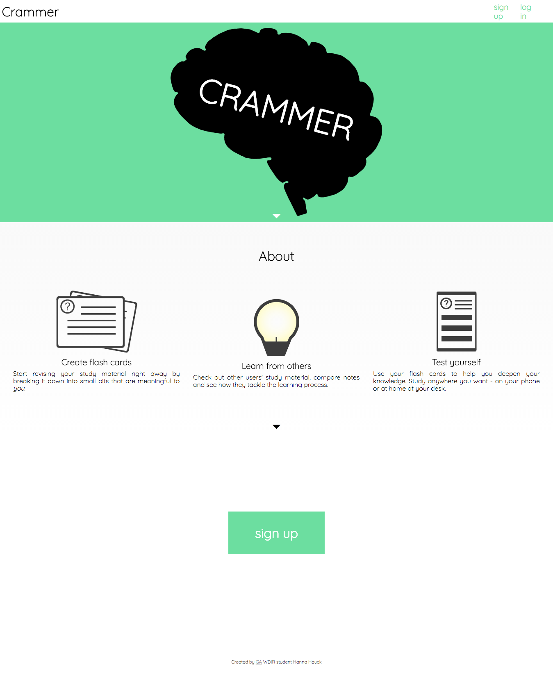
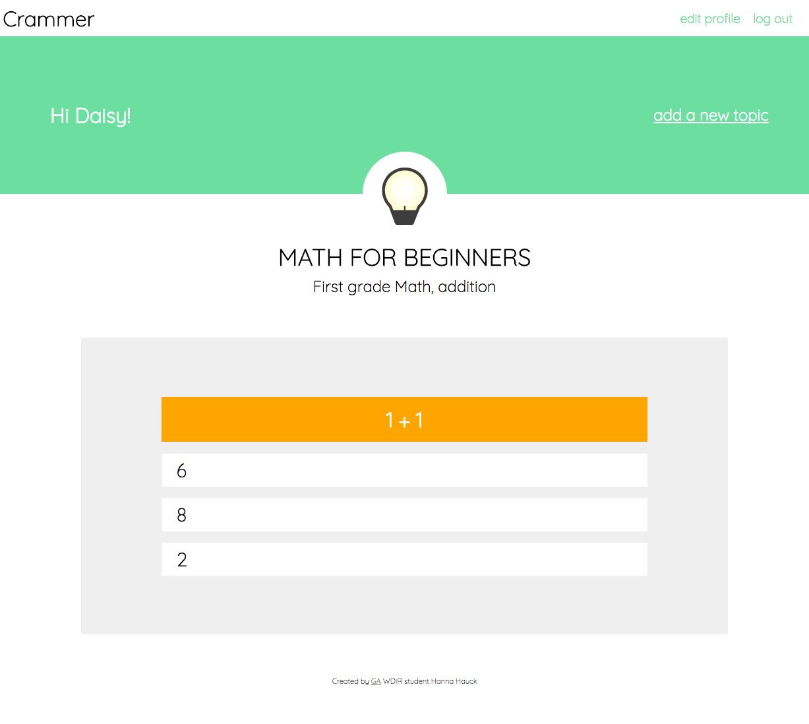

# WDIR Unit 2 Project: Study App Crammer

**Summary:** A full stack web app for creating and storing flash cards, includes a simple quiz tool

**Link:** https://study-tool.herokuapp.com

**Technologies used:** HTML, CSS, Vanilla JavaScript, EJS, Express, MongoDB, Mongoose, SVG, AJAX

**Approach:**
- Full-stack web application
- hosted on Heroku and GitHub
- Model, Views, Controller (MVC) structure
- Data organization follows three model structure: user Schema, topic Schema, flash card Schema
- Users can create an account and if logged in
    - add topics
    - add flash cards to their topics
    - edit or delete their own profile
    - edit or delete their own topics and flashcards
    - browse a limited amount of other users' topics
    - revise with their own or someone else's flash cards
- RESTful routes for the topic module, additional GET, POST, PUT, DELETE routes for the other two models
- MongoDB used as database and Mongoose for database queries
- bcrypt used for password encryption
- all vector graphics used were created by me using GIMP
- handwritten CSS, no frameworks used
- page design is responsive
- multiple-choice quiz is written in jQuery, makes an AJAX request to own database to load flash card information

**Unsolved Issues:**
- included only basic error handling (errors are sent, no special error page is rendered for most cases)
- UX Design could be improved
- app does not track quiz scores yet (I wanted to include statistics)
- I wanted to include a functionality that allows logged in users to search for other users by user name and allow them to 'follow' them, so they can connect and study together, but time did not permit me to include this
